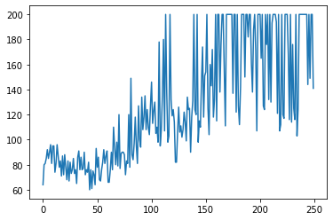

In this notebook, I will go through a quick implementation (about 130 lines) of DQN (https://www.cs.toronto.edu/~vmnih/docs/dqn.pdf). For starters, DQN, or Deep Q Network, is Q Learning (see https://dylanamiller.github.io/ to get spun up on the details) with extra bells and whistles; the main bell and/or whistle being the use of a neural network as the function approximator - interestibly enough, doing this for Q Learning actuall causes the algorithm to have no gaurentee of convergence (https://www.mit.edu/~jnt/Papers/J063-97-bvr-td.pdf) despite the algorithm's success. Along with using a neural network of course, come certain alterations to the Q Learning algorithm that are required in order to make it manageable. But do not let these things obscure what is really going on: Q Learning.

Note: I will be using Pytorch for this example. I will not however, discuss implementation details involved with using Pytorch.


```python
import torch
import torch.nn as nn
import torch.optim as optim
from torch.nn import functional as F

import numpy as np
import matplotlib.pyplot as plt

from random import sample
from statistics import mean, stdev
import copy

import gym
```

To begin, we define a class for the Experience Replay Buffer. This is the fancy name for the user defined data structure that will hold the transition tuples our algorithm will collect as it attempts to navigate the environment. DQN (even though it is really just Q Learning, I will revert to saying DQN as it saves space) is an off-policy algorithm. This means, that the policy being used to define the agent's behavior is not the one we are improving; the reason for this will be apparent in a bit. This means that we do not need to use current, by which I mean from the agent's history within the current update period, experience in order to train our agent. We can instead choose to use experience from the entire history or training. This is what makes off-policy algorithms more sample efficient that on policy algorithms.

In the __init__() function, we define maxlen, batch_size, and buffer. 

:maxlen defines how many experience (transition tuples of state, action, reward, next_state, next_action) we want to include in our buffer. After the buffer hits this limit, it will start removing data points, starting with the oldest; we may as well leave in the most recent for our agent to use. 

:batch_size determines how many data points we will use for each update.

:buffer of course stores the experience tuples.

In the add_exp() function, we first check to see if the buffer is full. If it is, we eject the oldest data point before adding in the new one.

In the prime() function, we add to the buffer randomly generated experience tuples until we a batch size worth of them. We do this as poadding for when the algorithm starts. Just in case there are not data points collected in the first episode to perform an update, we are still able to sample a full batch.

In the sample() function, we randomly sample from the buffer batch_size data points to use in our update.


```python
class Replay:
    def __init__(self, maxlen=10000, batch_size=128):
        self.maxlen = maxlen
        self.batch_size = batch_size
        
        self.buffer = []
        
    def add_exp(self, exp):
        def buffer_full():
            return True if len(self.buffer) == self.maxlen else False
        
        if buffer_full():
            self.buffer.pop()
        self.buffer.append(exp)
        
    def prime(self, env):
        for exp in range(self.batch_size):
            obs = env.reset()
            action = env.action_space.sample()
            next_obs, reward, _, _ = env.step(action)
            next_action = env.action_space.sample()
            
            obs = torch.from_numpy(obs).float().unsqueeze(0)
            next_obs = torch.from_numpy(next_obs).float().unsqueeze(0)
            
            self.add_exp((obs, action, reward, next_obs, next_action))
    
    def sample(self):
        return sample(self.buffer, self.batch_size)
```

The two functions below are just to help build the neural network. As we will be using the CartPole environment in this example, the network is simple.


```python
def get_layer(dim0, dim1):
    return nn.Sequential(
        nn.Linear(dim0, dim1),
        nn.ReLU()
    )
```


```python
def build_network(dims):
    return [get_layer(dims[i], dims[i+1]) for i in range(len(dims)-1)]
```

Now, we have the class the builds defines our network. The part worth looking at here, is the forward() function. We run the input, X, through the network to produce the Q values. What these are, are the expected return given that we are in some state and deviate from the policy for one step by taking some action, after which we return to following the policy - this tells us what the difference is if our agent takes a different action action than what our policy dictates with the current time step. 

You will notice that forward() has the argument action with a default of None. When collecting experience, no action will be passed to the function and it will return q_values. When performing our update however, we already know the actions we want, because they are in our experience tuples. Here, we will pass them to forward() in order to get the Q values only corresponding to the actions we want (i.e. the ones we have already taken) so that we can perform our update.


```python
class DQN(nn.Module):
    def __init__(self, input_dim, n_actions, hidden_dim=128, n_hidden=2):
        super(DQN, self).__init__()
        self.network = nn.Sequential(*build_network([input_dim] + [hidden_dim]*n_hidden))
        self.q_values = nn.Linear(hidden_dim, n_actions)
        
    def forward(self, X, action=None):
        X = self.network(X)
        q_values = self.q_values(X)
        
        if action:
            q_values = q_values[torch.arange(len(action)), action].view(-1,1)
        
        return q_values
```

To help our agent choose actions, we will use an epsilon greedy policy. This means, that most of the time we will greedily choose the action that the highest Q value, but epsilon percent of the time, we will choose an action randomly. It is common to decay the epsilon over the duration of training, much like you would the learning rate.

This is probably the most common way for DQN to handle the exploration vs exploitation dilema. In case you are not familiar with this concept (first I would go learn some Reinforcement Learning (RL) basics before trying to learn RL with neural networks, but I won't judge), exploration is how much our agent should look for new experience, and exploitation is how much our agent should prioritize behavior it already knows to be good (at least compared to its experience so far, which may or may not be optimal given the underlying environment dynamics); any good RL agent must find a way to balance these.


```python
def epsilon_greedy(q_values, episode, epsilon=0.3):
    r = np.random.rand()
    return torch.argmax(q_values).item() if r > (epsilon/episode) else np.random.randint(len(q_values.tolist()))
```

Finally, we have the training loop. First, I will walk through the Q Learning algorithm, then I will point out something about why the algorithm does what it does and the result of doing this, and finally I will explain the changes made in order to accomodate the neural network.

The first thing we have to do, is prime out buffer as described above. We only have to do this once for the entire run of the algorithm, because the agent will accumulate experience.

At the start of the episode, we get a new state. We use this, to get our Q values that correspond to the value of taking action in that state. With our Q values in hand, we use the epsilon greedy policy to choose an action. We use the chosen action to step the environment forward and get the reward and next state. This next state is run through the network to get its Q values. This time, instead of using our epsilon greedy policy to choose the action, we will simply choose the action with the highest Q value. 

This is our entire experience tuple. So we add (state, action, reward, next state and next action) to our buffer. At this point, we will set the state to be what is currently the next state and repeat the experience tuple collection process. 

At the end of the episode, we will randomly sample a batch from our buffer and perform our update. Now, the Q learning update is $R + \gamma max_{a \in A}Q_{\theta}(S_{t+1}, a) - Q_{\theta}(S_{t}, A_{t})$. This is very similar to the TD error, and it intuitively tells us that the update is the difference between what happened and what we expected to happen. 

And that is the algorithm. Or at least that is the Q learning algorithm. I will explain necessary changes in a moment. First however, I want to make a note of the second term in our update, $\gamma max_{a \in A}Q_{\theta}(S_{t+1}, a)$:

$\gamma$ is the discount factor. This tells us by how much we wish to say that future rewards are not as important as the current reward. 1 corresponds to no discount and says that we want all rewards considered equally and 0 says that only the current reward matter. The choice depends on the problem, but for toy problems such as CartPole, a value like 0.9 or 0.99 are fairly standard choices. 

The more important part of this term, is $max_{a \in A}Q_{\theta}(S_{t+1}, a)$. $R$ plus this term could describe a possible Q value from $S_{t}$ for a different policy. So, given a different policy, say with parameters $\theta'$, this could be written as $Q_{\theta'}(S_{t}, A_{t})$, which looks an awful lot like the final term of the update. It is this fact that makes Q Learning an off-policy algorithm. Rather than use the agent's behavior defining policy, epsilon greedy, to choose the action, we are using the max action. The result is that the agent is attempting the estimate the optimal policy. Cool strategy. 

This is also why we can use experience from any point in training. In RL, the state distribution underlying the agent's behavior is not stationary. As the agent learns, its probability of ending up in states changes as it action preference changes. For on-policy algorithms, where the agent is updating the same policy it is using to choose actions, that means that its policy is moving around underneath it quite a bit, so it can only use experience from its current update period. In Q Learning however, we are trying to estimate the optimal policy, which does not change. So, all data points converge toward it and will help with our updates.

Now, for the required (not really, but they make it work better) neural network changes. Since there is a considerable amount of noise that results from using a nonlinear function approximator and, in this case, constantly comparing Q values against a changing set of Q values, we will actually want to define two neural networks rather than one. We will not train our second network, but freeze it with the weights of the first network from a given update period. While this network will be kept frozen, we will occasionally set it to match the current weights of our training network. We will use this second network as our target (i.e. the term added to the reward). By keeping its weights, and therefore Q values, largely stationary, we are able to remove some noise from our updates. Imagine trying to throw pebbles in a jar, but the jar were to move every time you threw. It would be very difficult. By keeping it still, you will get better at aiming at the jar.

We will call the parameters of this second network $\theta'$. This makes our update $R + \gamma max_{a \in A}Q_{\theta'}(S_{t+1}, a) - Q_{\theta}(S_{t}, A_{t})$.

And that's it. DQN in about 130 lines.


```python
def train(env, q_network, optim, buffer, q_target, copy_network=200, n_episodes=250, max_steps=500, epsilon=0.3, gamma=0.9):
    buffer.prime(env)
    
    returns = []
    
    for episode in range(1, n_episodes+1):
        r = 0
        
        obs = env.reset()
        obs = torch.from_numpy(obs).float().unsqueeze(0)
        
        for step in range(1, max_steps+1):
            q_values = q_network(obs)
            action = epsilon_greedy(q_values, episode, epsilon=epsilon)
            next_obs, reward, done, _ = env.step(action)
            next_obs = torch.from_numpy(next_obs).float().unsqueeze(0)
            next_q_values = q_network(next_obs)
            next_action = torch.argmax(next_q_values)
            
            buffer.add_exp((obs, action, reward, next_obs, next_action))
            
            r += reward
            
            obs = next_obs
            
            if done:
                returns.append(r)
                break
                
        batch = buffer.sample()
        
        obss, actions, rewards, next_obss, next_actions = [exp for exp in zip(*batch)]
        
        obss = torch.stack(obss).squeeze()
        next_obss = torch.stack(next_obss).squeeze()
        rewards = torch.tensor(rewards).view(-1,1)

        td_loss = F.smooth_l1_loss(rewards + gamma*q_target(next_obss, next_actions), q_network(obss, actions))
        
        optim.zero_grad()
        td_loss.backward()
        optim.step()
        
        if episode % copy_network == 0:
            q_target.load_state_dict(q_network.state_dict())
        
        if episode % 10 == 0:
            print('Episode: {} - TD Loss: {:.4f} - Return: {} - Avg Return: {:.4f} - Std Return: {:.4f}'.format(episode, td_loss.item(), r, mean(returns), stdev(returns)))
            
    plt.plot(returns)
    plt.show()
```

In this cell, I am just setting up the problem. Not very exciting.


```python
def main(environment='CartPole-v0', seed=0, n_hidden=2, hidden_dim=128, epsilon=0.3, gamma=0.9, buffer_size=10000, batch_size=128):
    env = gym.make(environment)
    obs_dim = env.observation_space.shape[0]
    n_actions = env.action_space.n
    
    np.random.seed(seed)
    torch.manual_seed(seed)
    env.seed(seed)
    
    q_network = DQN(obs_dim, n_actions, hidden_dim=hidden_dim)
    q_target = DQN(obs_dim, n_actions, hidden_dim=hidden_dim)
    q_target.load_state_dict(q_network.state_dict())
    q_target.eval()
                             
    optimizer = optim.Adam(q_network.parameters(), lr=1e-4)
    buffer = Replay()
    
    train(env, q_network, optimizer, buffer, q_target, epsilon=epsilon, gamma=epsilon)
```


```python
if __name__ == '__main__':
    main()
```

    Episode: 10 - TD Loss: 0.4864 - Return: 95.0 - Avg Return: 84.9000 - Std Return: 9.3862
    Episode: 20 - TD Loss: 0.4415 - Return: 72.0 - Avg Return: 83.6500 - Std Return: 9.0045
    Episode: 30 - TD Loss: 0.3929 - Return: 73.0 - Avg Return: 81.5333 - Std Return: 8.8463
    Episode: 40 - TD Loss: 0.3497 - Return: 72.0 - Avg Return: 81.0250 - Std Return: 8.6780
    Episode: 50 - TD Loss: 0.3025 - Return: 93.0 - Avg Return: 79.4800 - Std Return: 9.3814
    Episode: 60 - TD Loss: 0.2706 - Return: 91.0 - Avg Return: 79.7000 - Std Return: 9.2137
    Episode: 70 - TD Loss: 0.2247 - Return: 79.0 - Avg Return: 80.2429 - Std Return: 10.0397
    Episode: 80 - TD Loss: 0.1909 - Return: 120.0 - Avg Return: 81.5875 - Std Return: 11.4656
    Episode: 90 - TD Loss: 0.1626 - Return: 100.0 - Avg Return: 83.8222 - Std Return: 14.4895
    Episode: 100 - TD Loss: 0.1311 - Return: 127.0 - Avg Return: 87.0600 - Std Return: 17.3455
    Episode: 110 - TD Loss: 0.1060 - Return: 108.0 - Avg Return: 90.1091 - Std Return: 20.4950
    Episode: 120 - TD Loss: 0.0814 - Return: 119.0 - Avg Return: 94.3667 - Std Return: 26.4502
    Episode: 130 - TD Loss: 0.0634 - Return: 108.0 - Avg Return: 95.2692 - Std Return: 25.8963
    Episode: 140 - TD Loss: 0.0489 - Return: 200.0 - Avg Return: 97.4429 - Std Return: 27.2117
    Episode: 150 - TD Loss: 0.0337 - Return: 151.0 - Avg Return: 99.9867 - Std Return: 29.0410
    Episode: 160 - TD Loss: 0.0282 - Return: 200.0 - Avg Return: 103.1625 - Std Return: 31.6826
    Episode: 170 - TD Loss: 0.0232 - Return: 200.0 - Avg Return: 107.0588 - Std Return: 35.5193
    Episode: 180 - TD Loss: 0.0187 - Return: 200.0 - Avg Return: 111.4389 - Std Return: 39.5494
    Episode: 190 - TD Loss: 0.0137 - Return: 182.0 - Avg Return: 114.5895 - Std Return: 41.4650
    Episode: 200 - TD Loss: 0.0129 - Return: 200.0 - Avg Return: 117.6850 - Std Return: 43.1688
    Episode: 210 - TD Loss: 0.0563 - Return: 200.0 - Avg Return: 120.2905 - Std Return: 44.2518
    Episode: 220 - TD Loss: 0.0376 - Return: 112.0 - Avg Return: 122.3545 - Std Return: 45.0675
    Episode: 230 - TD Loss: 0.0247 - Return: 114.0 - Avg Return: 124.1435 - Std Return: 45.6129
    Episode: 240 - TD Loss: 0.0174 - Return: 200.0 - Avg Return: 125.8208 - Std Return: 46.0917
    Episode: 250 - TD Loss: 0.0117 - Return: 141.0 - Avg Return: 128.1240 - Std Return: 46.8284




